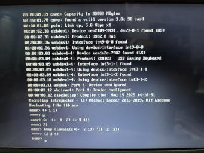

# piBMLisp

piBMLisp(Raspberry pi Bare metal Lisp) is a toy lisp interpreter based on [Circle](https://github.com/rsta2/circle),[circle-stdlib](https://github.com/smuehlst/circle-stdlib) and [microlisp](https://github.com/lazear/microlisp):now it's only use circle-stdlib's IO function as the lisp REPL.The effect on my "rpi4b-notebook":

{:height="300px" width="300px"}{:height="300px" width="300px"}

## Build
you have to make circle and circle-stdlib well(you can test the samples,especially [circle-stdlib sample2 02-stdio-hello](https://github.com/smuehlst/circle-stdlib/tree/master/samples/02-stdio-hello)).If everything is fine,copy or clone the project under the circle-stdlib's sample folder(to use the makefile and environment) ,then make.The kernel8-rpi4.img is the result(I think you can use the kernel8-rpi4.img of the project directly)

## Install

I have only run the img under rpi-4b.I don't know if it can run on other rpi model(if it can,the img file name should be change)

### 1 Copy the img file and other files

you should replace the img file of rpi4 of your sd card.I found these ways:

1. [Make an sd card using circle's install guide](https://github.com/rsta2/circle?tab=readme-ov-file#installation)

2. [Make an sd card using rust-rpi-os's install guide](https://github.com/rust-embedded/rust-raspberrypi-OS-tutorials/tree/master/05_drivers_gpio_uart#rpi-4)

3. Using a offical rpi4's os sd card,then replace(backup the orginal first)the img file

### 2 Prepare the config.txt and cmdline.txt file

copy(or edit the options) the config.txt and cmdline.txt on the sd card's top floder(you can find it under this project's configFile folder).

the config.txt option are seperated line by line:
(https://www.raspberrypi.com/documentation/computers/config_txt.html)

but cmdline.txt option are seperated by space:

(https://raspberrytips.com/raspberry-pi-cmdline-txt/)
!

make sure the option

    keymap=US

is in cmdline.txt(the default keymap of circle and circle-stdlib seems is DE).And it seems the option 

    width=640 height=480

make the text look bigger,I suggest to add this option

## TODO list

There is two edition of microlisp:[scheme](https://github.com/lazear/microlisp/tree/master/scheme) and [scheme-gc](https://github.com/lazear/microlisp/tree/master/scheme-gc),I just copy the scheme code(it seems easier) to circle-stdlib kernel.cpp,fix some error that vscode (with WSL's vscode plugin),change the main function:

    CStdlibApp::TShutdownMode CKernel::Run (void)

than it worked(lucky)

I'll try these things next:

1. try to create some file-system function,like (ls)
(try to warp the circle-stdlib's file opreation function)

2. now the interpreter can only eval the single line expression,it's better there is a easiest editor that can edit the lisp code,so I can write more lines,and save/reload it.The editor better look like the classic QBasic's IDE

3. fix the microlisp's bug,and make it faster:
Now microlisp seems lake of error handle:the expression

    (map (lambda(x)(+ x 1)) '(1 2 3))

works,but if missing the bracket:

    (map (lambda(x)(+ x 1) '(1 2 3))

there is no error report on screen(in original microlisp either)

some tiny lisp interpreter like [Mal](https://github.com/kanaka/mal)'s c edition can show the error message

and the microlisp seems read the expression from stdin every single char,better make it faster

4. The lisp interpreter itself can manage the memery,need to learn the detail

5. It's better be a chess and a go game,start it using (chess) and (go)

6. There is other rpi4b function,like opengl,may be can try them

